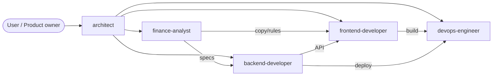
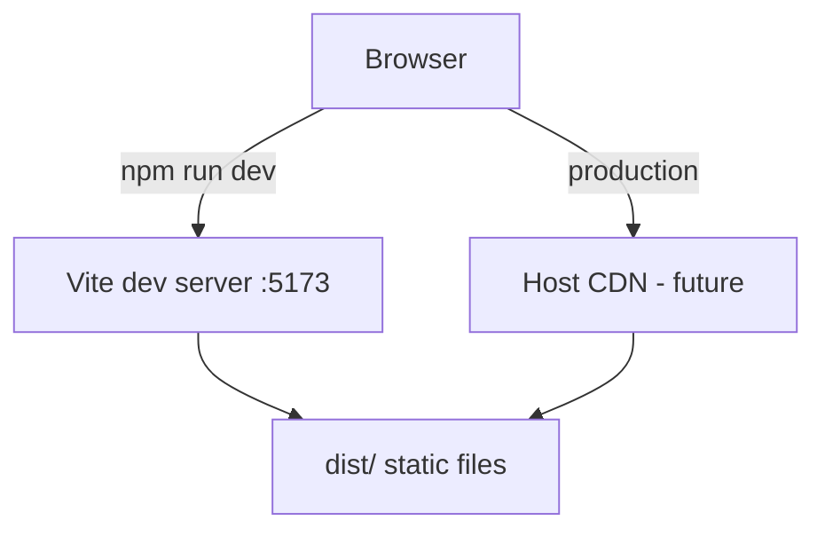
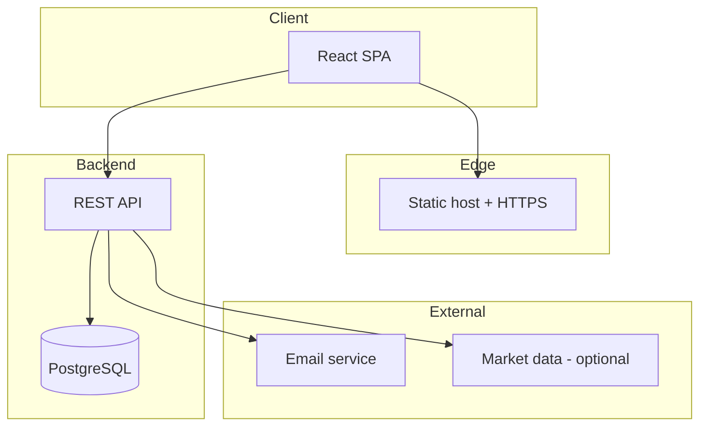
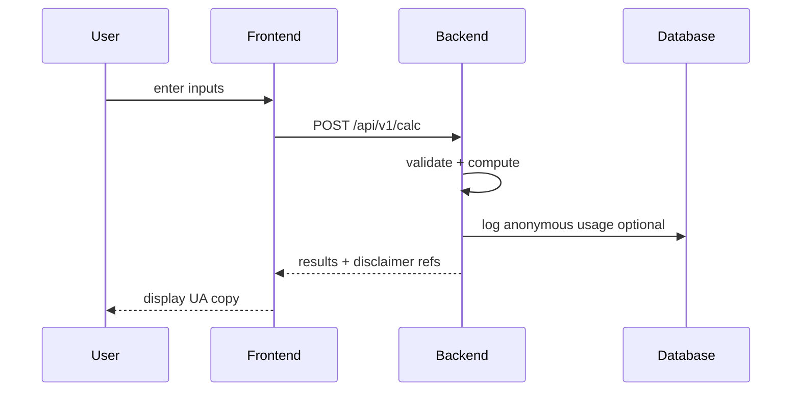

# System Architecture (IFA)

## Product goal

Educational IFA website: language gate → Ukrainian main site → tools/content for personal finance. English later.

## Current repo map

```
ifa/
├── AGENTS.md              # team + conventions
├── .cursor/
│   ├── agents/            # specialist subagents
│   ├── skills/            # on-demand playbooks
│   └── rules/             # always-on constraints
├── frontend/              # Vite + React SPA (live)
│   └── src/pages/         # /, /uk, /en
├── backend/               # planned — not yet present
└── docs/                  # planned — specs, API contracts
```

## Agent responsibilities



## Runtime layers (today)



Routes: `/` language → `/uk` home | `/en` stub.

## Target architecture (full site)



## What a working public site needs

| Layer | Purpose | Owner agent | Status |
|-------|---------|-------------|--------|
| Frontend UI | pages, routing, UX | frontend-developer | partial |
| Domain rules | formulas, disclaimers | finance-analyst | skill only |
| Backend API | auth, calculations, data | backend-developer | missing |
| Database | persistent data | backend-developer | missing |
| Build | `npm run build` | devops-engineer | works |
| Hosting | serve `dist/` 24/7 | devops-engineer | not set up |
| CI | test + build on push | devops-engineer | missing |
| Domain + TLS | public URL | devops-engineer | missing |
| Docs | API + architecture | architect | minimal |

**MVP without backend:** static SPA on CDN is enough for marketing + language gate.

**MVP with calculators:** backend or edge functions for authoritative math; finance-analyst specs first.

## Data flow example (future calculator)



## Dependency order (recommended)

1. Frontend shell + routing ✅
2. Git repo + deploy pipeline
3. Main UA pages (content structure)
4. finance-analyst specs for first tool
5. Backend + API if server-side logic required
6. Auth only when user accounts needed
7. English locale when UA stable

## Architecture decisions to confirm with user

- Static-only vs backend for v1 calculators
- Hosting provider (Vercel / Netlify / other)
- Auth scope (anonymous vs accounts)
- Monorepo vs separate frontend/backend repos

## Diagram conventions

- Use mermaid in chat and `docs/architecture.md` when persisting
- Label protocols: HTTPS, REST, SQL
- Mark **current** vs **planned** in diagrams or legend
- Keep one concern per diagram; link levels top-down

## Success criteria (architecture view)

- User reaches site over HTTPS from internet
- `/`, `/uk`, `/en` work on refresh (SPA fallback)
- Financial features traceable: spec → API → UI → disclaimer
- Clear owner per layer; no duplicate business logic in FE and BE
- Secrets and PII only on backend; static host has no keys
