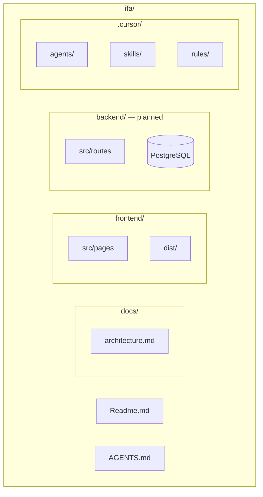
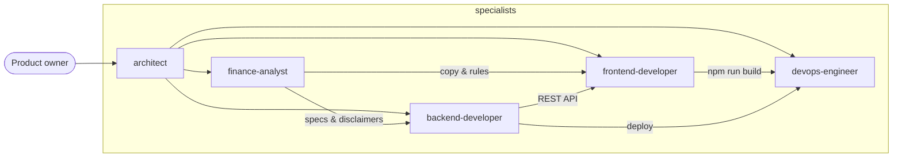
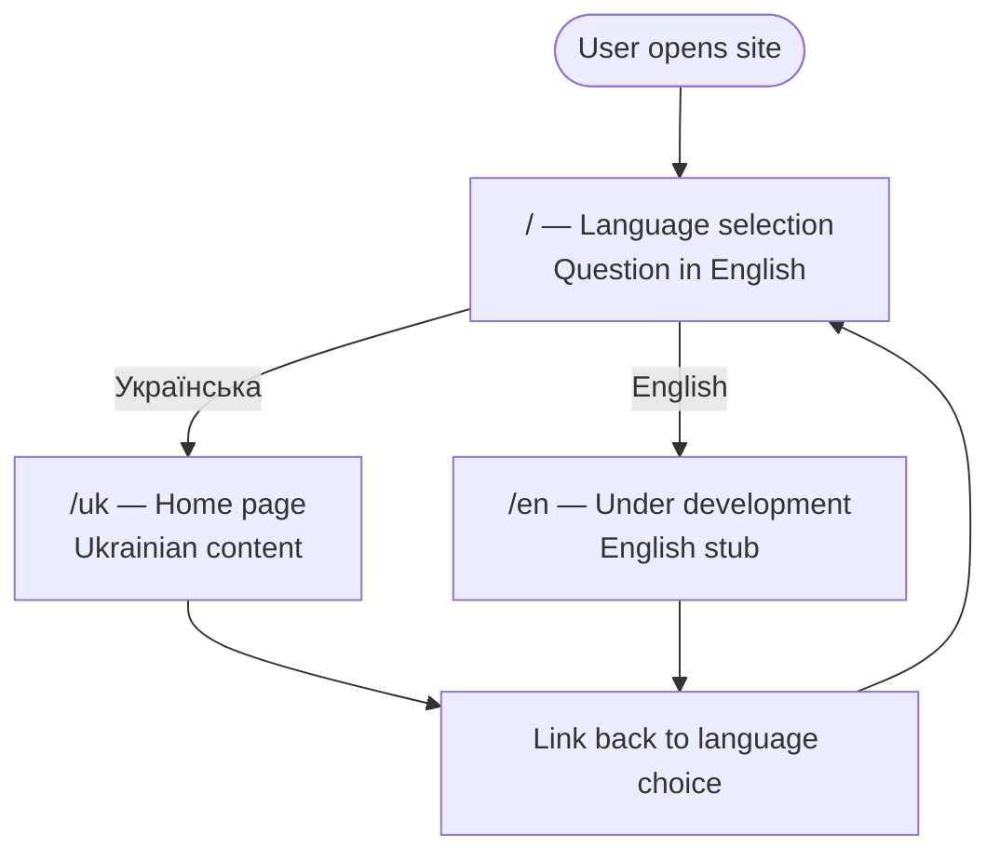
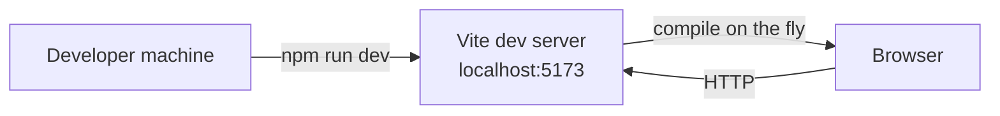
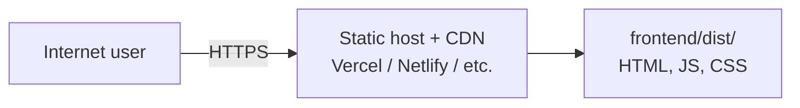
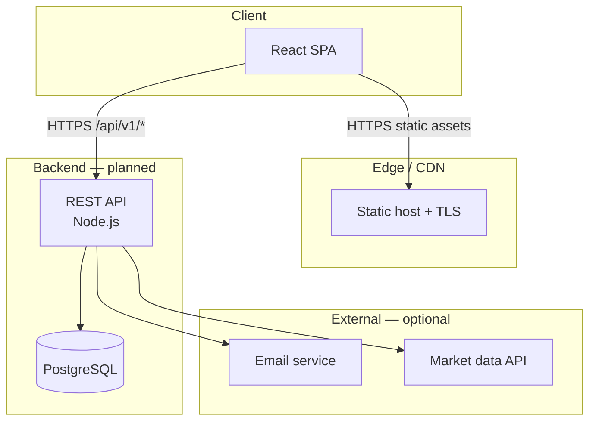
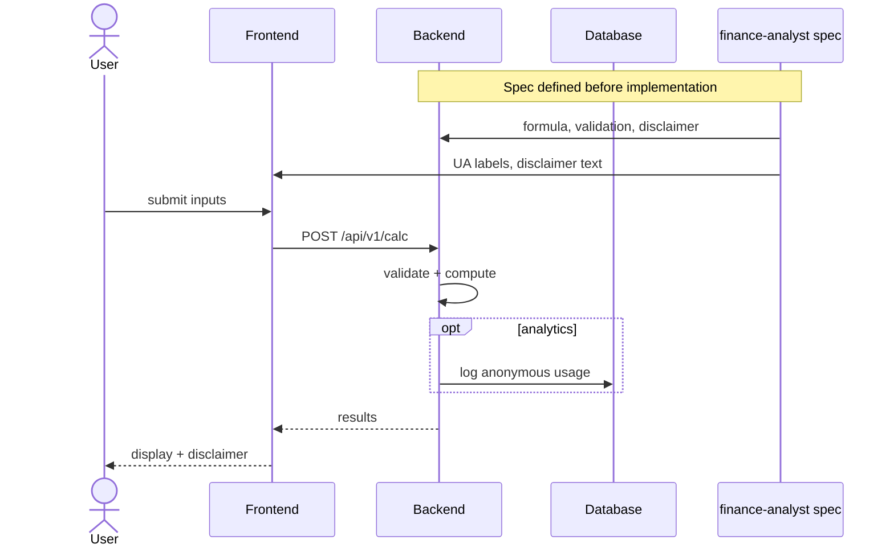
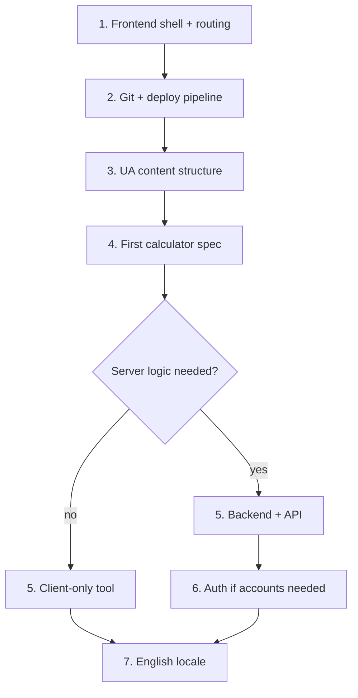

# IFA — System Architecture

Technical overview: components, connections, and technology stack. Product and domain context — [Readme.md](../Readme.md).

**Legend:** solid = current · dashed = planned

---

## Technology stack

### In use (frontend)

| Layer | Technology | Version (approx.) | Role |
|-------|------------|-------------------|------|
| Runtime | Node.js | 14+ (18+ recommended for CI) | dev & build |
| UI library | React | 18.x | components, pages |
| Language | TypeScript | 4.9.x | type safety |
| Bundler / dev server | Vite | 2.9.x | `npm run dev`, `npm run build` |
| Routing | React Router | 6.x | `/`, `/uk`, `/en` |
| Styling | CSS (custom) | — | layout, cards, buttons |

### Planned (backend)

| Layer | Technology | Role |
|-------|------------|------|
| Runtime | Node.js + TypeScript | API server |
| Framework | Fastify or Express | HTTP routes |
| Database | PostgreSQL | persistent data |
| ORM | Prisma or Drizzle | schema, migrations |
| Auth | JWT or session cookies | users (when needed) |

### Planned (operations)

| Layer | Technology | Role |
|-------|------------|------|
| Version control | Git + GitHub | source, collaboration |
| Frontend hosting | **Cloudflare Pages** | `https://family-wealth.pro` — see [cloudflare-pages-and-domain.md](./cloudflare-pages-and-domain.md) |
| Legacy hosting | GitHub Pages (retired) | `anton-cheg-pro.github.io/ifa/` — disable in repo Settings → Pages |
| Pages (Phase 1f) | `/uk/about` + `/uk/contact` split | see [tasks.md](./tasks.md) Phase 1f |
| Alt hosting | Vercel / Netlify | optional |
| CI | GitHub Actions | build on push |
| Backend hosting | Railway / Render / VPS | API (when added) |
| TLS | Let's Encrypt (via host) | HTTPS |

### Tooling (development)

| Tool | Location | Role |
|------|----------|------|
| Cursor agents | `.cursor/agents/` | specialized subagents |
| Cursor skills | `.cursor/skills/` | domain & deploy playbooks |
| Cursor rules | `.cursor/rules/` | e.g. ask before implementation |

---

## Repository structure

---

## Agent team & dependencies

| Agent | Delivers to |
|-------|-------------|
| finance-analyst | backend-developer, frontend-developer |
| backend-developer | frontend-developer (API contracts) |
| frontend-developer | devops-engineer (build artifact) |
| architect | all (structure, diagrams, sequencing) |

---

## User journey (current)

---

## Runtime: development vs production

### Development (today)

- Server runs only while terminal is open
- Not accessible from the public internet

### Production (target)

- `npm run build` produces `dist/`
- Hosting provider serves files 24/7
- SPA fallback required: all routes → `index.html`

---

## Target system (full product)

---

## Data flow: future calculator

Financial calculations must be authoritative on the server when accuracy and audit matter.

---

## Component status

| Component | Technology | Status |
|-----------|------------|--------|
| Language gate | React Router | ✅ live |
| UA home page | React | ✅ live |
| EN stub | React | ✅ live |
| Backend API | Node + PostgreSQL | ⏳ planned |
| Calculators | FE + BE + finance specs | ⏳ planned |
| Public deploy | static host | ⏳ planned |
| CI pipeline | GitHub Actions | ⏳ planned |
| Custom domain | DNS + host | ⏳ planned |

---

## Recommended build order

1. Frontend shell + routing — **done**
2. Git repo + deploy pipeline
3. Main UA pages structure
4. finance-analyst spec for first tool
5. Backend if server-side math or data required
6. Auth only when user accounts needed
7. English when UA is stable

---

## Open architecture decisions

| Decision | Options | Impact |
|----------|---------|--------|
| v1 calculators | static vs API | complexity, accuracy |
| Hosting | Vercel / Netlify / Cloudflare | deploy config |
| Auth | anonymous vs accounts | backend scope |
| Repo layout | monorepo vs split | CI, deploy paths |

Confirm with product owner before major changes (project rule: ask before implementation).
