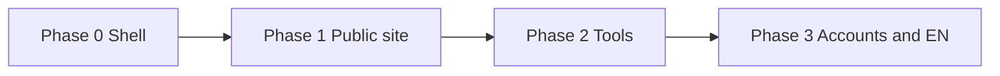
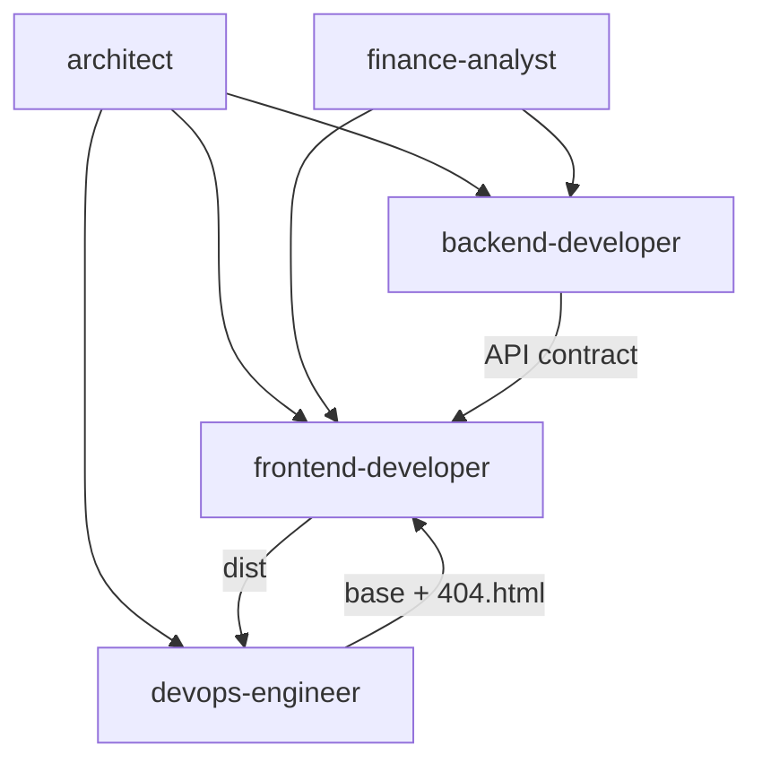

# IFA — Task Backlog

Prioritized, checkable work items by Cursor agent. Aligns with [architecture.md](./architecture.md) and [Readme.md](../Readme.md).

**Current baseline:** React + Vite SPA with `/` (language gate), `/uk` (home stub), `/en` (stub). No public deploy, no backend.

**Conventions:** user-facing copy in Ukrainian; code comments and this doc in English; financial claims require `finance-analyst` review before ship. **Any temporary placeholder** (copy, email, images, URLs) **must be logged** in [Replace later](#replace-later-before-public-launch) — do not leave only in chat or code comments.

## Product scope (decided)

| Now (Phase 1) | Deferred |
|---------------|----------|
| **Family Wealth** branding, UA landing, full-width hero | **Calculators** — not planned yet |
| Design system, menu, sections | **Client logins** — not planned |
| GitHub Pages | **PostgreSQL / backend** — low priority |

---

## Frontend readiness

**Can start now:** design tokens, layout components, section shells on `/uk`, placeholders, header/footer structure, mobile nav.

**Still needed for final copy (finance-analyst, not blocking layout):**

- `docs/content/homepage-copy.md` — hero, sections text
- `docs/content/navigation-labels.md` — menu labels
- `docs/legal/disclaimers-ua.md` — footer legal text

Until those exist: use `[TODO: finance-analyst]` or minimal draft from `Readme.md` disclaimer; **ask user** on CTA target (mailto vs external link vs none).

**Open for PO before polish:**

1. Brand name in hero or neutral «незалежний радник»?
2. Contact CTA in v1: `mailto:`, external link, or section scroll only?
3. Single-page `/uk` with anchors vs separate routes for `/uk/about`?

---

## Design reference (local)

Layout inspiration lives in **`docs/design-reference.local.md`** (gitignored). Do not add external reference URLs to committed files.

| Section | IFA equivalent (UA) | v1 owner |
|---------|---------------------|----------|
| Hero + CTA | Value prop + «Дізнатися більше» | frontend-developer |
| Social proof | Trust block (education; no fake ratings) | frontend-developer |
| How it works | 3–4 steps: learn → understand → decide | frontend-developer + finance-analyst |
| Offerings | Topic cards: budget, savings, investments, pension | frontend-developer |
| Materials teasers | «Матеріали» — static placeholders | frontend-developer |
| Footer + disclosures | Legal disclaimer, links, contact CTA | finance-analyst + frontend |
| Advisor photos | Placeholder images | frontend-developer (user photos later) |

**Do not ship:** fake testimonials, star ratings, income promises.

---

## Phased roadmap



| Phase | Goal | Exit criteria |
|-------|------|----------------|
| **0** Foundation | SPA shell | `/`, `/uk`, `/en` local; `npm run build` OK — **mostly done** |
| **1** Public MVP | Professional UA landing on GitHub Pages | HTTPS URL; deep links work on refresh |
| **2** Tools | Calculators | **deferred** — not in current plan |
| **3** Growth | EN + accounts + API/DB | **deferred** — logins not planned; DB low priority |

---

## architect

- [ ] **P0** Link this file from `Readme.md`
- [ ] **P0** Update `architecture.md`: GitHub Pages as production host
- [ ] **P1** IA: `/uk` single-page scroll + anchors in Phase 1; `/uk/tools/*` in Phase 2
- [ ] **P1** Document static vs PostgreSQL boundary (table below) — PO sign-off
- [ ] **P1** `docs/content-model.md`: section IDs, image slots, CTA targets
- [ ] **P2** `docs/api/v1.md` sketch before backend scaffold
- [ ] **P2** Monorepo layout for `backend/` (same repo, separate deploy from Pages)
- [ ] **P3** Auth decision record: anonymous vs accounts

### Static site vs PostgreSQL

| Static (Git + GitHub Pages) | PostgreSQL + API |
|-----------------------------|------------------|
| Marketing copy, disclaimers | User accounts, sessions |
| Language gate, landing layout | Saved calculator scenarios |
| Placeholder / personal photos | Contact form submissions (if in-house) |
| Client-only calculators (if approved) | Server calculations + audit log |
| Markdown/JSON articles in repo | Dynamic CMS, comments |
| `mailto:` / external scheduler | Newsletter, email opt-in with consent |
| `VITE_*` public env vars | Secrets, API keys, PII |

---

## finance-analyst

**Role:** domain rules, UA copy, calculator specs, disclaimers. Blocks financial features without spec.

**Priorities:** **P0** blocks MVP launch · **P1** next wave · **P2** EN + deep content

### A. Positioning and tone

- [ ] **FIN-P0-001** — `docs/content/positioning.md` (one-liner, audience, forbidden claims)
- [ ] **FIN-P0-002** — `docs/content/tone-of-voice.md`
- [ ] **FIN-P0-003** — Table: forbidden phrase → safe alternative

### B. Homepage `/uk` (landing sections)

- [ ] **FIN-P0-010** — `docs/content/homepage-structure.md` (section order; **no tools-teaser** until calculators planned)
- [ ] **FIN-P0-011** — Hero copy → `docs/content/homepage-copy.md` → **REP-004**
- [ ] **FIN-P0-012** — audience, problem, approach copy
- [ ] **FIN-P0-013** — how-it-works (3–4 steps)
- [ ] **FIN-P1-014** — topics cards (6 themes)
- [ ] **FIN-P1-016** — social-proof placeholder (no fake reviews; mission / about author)
- [ ] **FIN-P0-030** — `docs/content/navigation-labels.md` (header/footer UA)

### C. Calculator specs — **deferred** (not in current plan)

> Skip until product owner requests calculators.

- [ ] **FIN-P3-100+** — calculator specs when scope opens

### D. Legal and compliance

- [ ] **FIN-P0-200** — `docs/legal/disclaimers-ua.md` (full + short) → unblocks **REP-005**
- [ ] **FIN-P0-201** — `/uk/legal` page structure + draft
- [ ] **FIN-P0-202** — `docs/legal/privacy-ua.md` (minimal for v1)
- [ ] **FIN-P0-210** — Disclaimer placement spec for homepage
- [ ] **FIN-P0-220** — `docs/legal/content-review-checklist.md`

### E. Content pages (after homepage)

- [ ] **FIN-P1-020** — `/uk/about` outline
- [ ] **FIN-P1-021** — `docs/content/topics-index.md`
- [ ] **FIN-P2-022** — `docs/content/article-template.md`
- [ ] **FIN-P2-023** — First article: «Резервний фонд» (800–1200 words UA)

### Open questions (PO) — see also REP-007, REP-008

1. Brand name ~~or neutral~~ → **Family Wealth** ✓
2. Contact CTA in v1: `mailto:`, external link, or scroll-only? → **REP-008**
3. Real testimonials at launch or placeholders only? (currently: mission quote only)
4. Real contact email for **REP-001**
5. Personal photos for **REP-002**, **REP-003**

**Decided:** site name **Family Wealth** · no calculators · no client logins · database low priority / not now.

---

## Family Wealth — branding & hero (PO)

**Orthography (user input → correct UA):**

| User wrote | Correct | Note |
|------------|---------|------|
| база знаннь | **База знань** | «знаннь» — помилка; правильно «знань» |
| наші послуги | **Наші послуги** | велика літера в меню |
| контакти | **Контакти** | велика літера в меню |

**Menu (header):** Як ми працюємо · Наші послуги · База знань · Контакти

| ID | Task | Owner | Status |
|----|------|-------|--------|
| FW-001 | Site name **Family Wealth** in header, footer, `<title>`, language page | frontend | [x] |
| FW-002 | Nav labels + anchor IDs (`#how-we-work`, `#services`, `#knowledge`, `#contact`) | frontend | [x] |
| FW-003 | Full-width hero photo + centered overlay text | frontend | [x] |
| FW-004 | Hero UA: «Тримай свої фінанси під контролем» | frontend | [x] |
| FW-005 | Hero EN subline: «Earn more. Spend less. Invest the rest.» | frontend | [x] |
| FW-006 | Hero image `public/images/hero.jpg` (from PO photo) | frontend | [x] |
| FW-007 | Section titles aligned with menu (Як ми працюємо, Наші послуги, База знань) | frontend | [x] |
| FW-008 | `finance-analyst` review of hero/menu copy for compliance | finance-analyst | [ ] |
| FW-009 | Optimize hero.jpg for web (size/compression) if deploy slow | devops / frontend | [ ] |
| FW-010 | REP-003: use same or crop of hero photo for avatar block | PO → frontend | [x] |

---

## Frontend implementation steps (homepage polish)

Incremental `/uk` polish — one step per PR/session. Do not batch unless PO asks.

| Step | Scope | Status |
|------|-------|--------|
| **1** | Section order matches nav (Hero → #how-we-work → #services → #knowledge → #contact); merge audience/problem/approach into `#how-we-work`; `scroll-margin-top`; header transparent over hero; FW-010 avatar crop from `hero.jpg` | [x] |
| **2** | Compress `hero.jpg` (FW-009, ~7MB → web target); polish **Наші послуги** / **База знань** cards; production preview with `GITHUB_PAGES=true` | [ ] |
| **3** | Footer polish, inline disclaimer under hero; `finance-analyst` copy sync when ready | [ ] |

---

## Replace later (before public launch)

Temporary values in code today → replace before treating the site as «live». Add new placeholders here when introduced.

| ID | What | Current placeholder | Owner | File / location |
|----|------|---------------------|-------|-----------------|
| REP-001 | Contact email | links + form UI (no server) | **PO** | Linktree / Telegram / Instagram; form backend **REP-009** |
| REP-002 | Hero image | `hero.jpg` (PO photo) | **done** | `frontend/public/images/hero.jpg` |
| REP-003 | Advisor avatar | crop of `hero.jpg` (CSS) | **done** | `frontend/src/sections/SocialProofSection.tsx` — `MissionQuote` |
| REP-004 | All UA copy | draft in `uk.ts` | **finance-analyst** → frontend | `frontend/src/content/uk.ts` — sync from `docs/content/*.md` when ready |
| REP-005 | Footer disclaimer | draft from Readme | **finance-analyst** | `docs/legal/disclaimers-ua.md` → `uk.ts` → `SiteFooter` |
| REP-006 | Materials section note | `[TODO: finance-analyst]` in subtitle | **finance-analyst** | `uk.ts` → `materials.subtitle` |
| REP-007 | Brand name | **Family Wealth** | **done** | `uk.ts`, header, footer |
| REP-008 | Contact CTA | Linktree + social links + form | **done** | `CtaSection.tsx`; server submit → **REP-009** |

### Checklist

- [x] **REP-008** — Contact links + intake form (client-only until REP-009)
- [ ] **REP-009** — Wire contact form to backend / Formspree / email service
- [x] **REP-002** — Hero photo `hero.jpg` installed
- [x] **REP-003** — Avatar uses cropped `hero.jpg` in mission quote block (FW-010)
- [ ] **REP-004** — finance-analyst delivers `homepage-copy.md` + nav labels; frontend merges into `uk.ts`
- [ ] **REP-005** — finance-analyst finalizes `disclaimers-ua.md`; frontend updates footer
- [ ] **REP-006** — finance-analyst removes TODO from materials copy
- [x] **REP-007** — Brand **Family Wealth** in site chrome
- [ ] **REP-001** — ~~email~~ replaced by social links (done); optional dedicated email later

---

## frontend-developer

### Design system (professional landing)

- [x] **P1** `frontend/src/styles/tokens.css` — colors, spacing, typography, breakpoints
- [x] **P1** Layout: `Container`, `Section`, `PageLayout`
- [x] **P1** UI: `Button`, `Card`
- [x] **P1** `SiteHeader` — nav anchors, language switcher, mobile menu
- [x] **P1** `SiteFooter` — disclaimer, links

### Landing `/uk`

- [x] **P1** `HeroSection`, `SocialProofSection`, `HowItWorksSection`
- [x] **P1** `OfferingsSection` → `TopicsSection`, `MaterialsSection`, `CtaSection`
- [x] **P1** `HomePage.tsx` composes sections via `PageLayout`
- [x] **P1** `frontend/public/images/placeholders/` — hero, avatar SVG
- [x] **P1** `frontend/src/content/uk.ts` — placeholder copy (→ **REP-004**, **REP-006**)

### Replace later (frontend)

- [ ] **REP-001** — Update `cta.email` when PO provides address
- [ ] **REP-002** — Replace `public/images/placeholders/hero.svg` with PO photo
- [x] **REP-003** — Avatar uses cropped `hero.jpg` in mission quote (FW-010)
- [ ] **REP-004** — Import final copy from `docs/content/` into `uk.ts`
- [ ] **REP-005** — Sync footer disclaimer from `docs/legal/disclaimers-ua.md`
- [ ] **REP-008** — Wire contact CTA per PO decision (mailto / external / none)

### GitHub Pages compatibility

- [x] Vite `base` for Pages — done
- [x] `BrowserRouter basename` — done
- [ ] **P1** Test `npm run build && npm run preview` with `GITHUB_PAGES=true`

### Deferred (out of current scope)

- [ ] **P3** Calculators, `/uk/tools/*`
- [ ] **P3** `frontend/src/api/client.ts` — when backend exists
- [ ] **P3** Full `/en` landing; i18n files

**Blocks for ship:** FIN-P0-200 (footer disclaimer text). Layout work can start without finance copy files.

---

## backend-developer

**Not in scope.** No backend, PostgreSQL, or auth until product owner requests.

<details>
<summary>Deferred backend tasks (future)</summary>

### API

- [ ] **P3** Scaffold `backend/` — Node.js + TypeScript
- [ ] **P3** `GET /api/v1/health`
- [ ] **P3** CORS for GitHub Pages origin

### PostgreSQL (low priority)

- [ ] **P3** Docker Compose, ORM, migrations
- [ ] **P3** Tables only when product requires persistence

### Accounts — not planned

- [ ] **P3** Auth — **out of scope** per product owner

</details>

**Note:** Backend does not run on GitHub Pages.

---

## devops-engineer

### GitHub repo

- [x] **P0** Create GitHub repo; push `main`
- [x] **P0** `.gitignore`
- [ ] **P1** «View site» link in Readme after first deploy

### GitHub Pages deploy

- [x] **P1** `.github/workflows/deploy-pages.yml`
- [x] **P1** `frontend/public/.nojekyll`
- [x] **P1** SPA `404.html` in workflow
- [x] **P1** Vite `base: '/ifa/'`
- [ ] **P1** Repo Settings → Pages → Source: **GitHub Actions** (manual, once)
- [ ] **P1** Smoke test: `/`, `/uk`, `/en` on https://anton-cheg-pro.github.io/ifa/

### CI

- [x] **P1** `.github/workflows/ci.yml`
- [ ] **P2** Backend CI when `backend/` exists

### GitHub Pages config

| Concern | Solution |
|---------|----------|
| Project URL `user.github.io/ifa/` | `base: '/ifa/'` in Vite |
| User/custom domain | `base: '/'` |
| React Router | `basename={import.meta.env.BASE_URL}` |
| Deep links on refresh | `404.html` = copy of `index.html` |
| CI flag | `GITHUB_PAGES=true` in workflow for `base` |

```js
// vite.config.js
base: process.env.GITHUB_PAGES === 'true' ? '/ifa/' : '/',
```

---

## Cross-agent dependencies



| Blocker | Blocked |
|---------|---------|
| FIN-P0-200 | Footer disclaimer (ship) |
| FIN-P0-011…013 | Final UA copy (layout can use placeholders) |
| PO: REP-001, REP-007, REP-008 | Contact email, brand, CTA |
| FIN-P0-200, REP-004 | Footer disclaimer + final copy |
| PO: REP-002, REP-003 | Hero and avatar images |

### Suggested sprint order (current scope)

1. **frontend-developer** — design system + `/uk` section shells + placeholders
2. **finance-analyst** — P0 copy + `disclaimers-ua.md` in parallel
3. **devops-engineer** — enable Pages in GitHub Settings if not done; smoke test
4. Complete **Replace later** checklist (REP-001…008); deploy

---

## Definition of done — Phase 1

- [ ] Public HTTPS URL on GitHub Pages
- [ ] `/`, `/uk`, `/en` work on navigation and direct refresh
- [ ] `/uk` has landing sections (hero, how-it-works, topics, etc.) + finance-analyst disclaimer
- [ ] No secrets in git; CI build green
- [ ] **Replace later** checklist REP-001…008 complete (no `example.com`, no placeholder SVGs if PO photos ready)
- [ ] Placeholder images swapped when PO provides photos (**REP-002**, **REP-003**)
