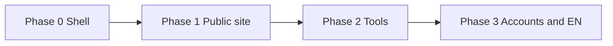
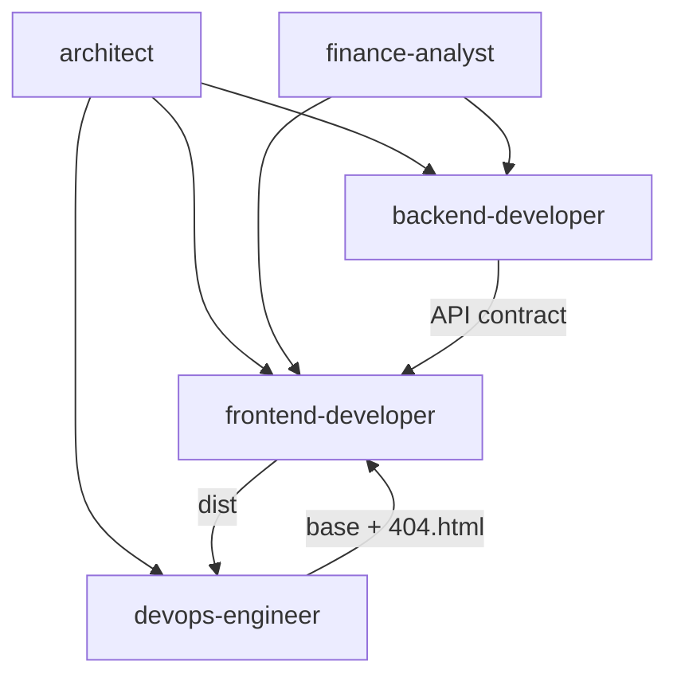

# IFA — Task Backlog

Prioritized, checkable work items by Cursor agent. Aligns with [architecture.md](./architecture.md) and [Readme.md](../Readme.md).

**Current baseline:** React + Vite SPA with `/uk` magazine homepage, `/en` stub. GitHub Pages deploy. Multi-page IA and consultation intake — **planned** (see [Phase 1b](#phase-1b--multi-page-site-navigation-po-jul-2026)).

**Conventions:** user-facing copy in Ukrainian; code comments and this doc in English; financial claims require `finance-analyst` review before ship. **Any temporary placeholder** (copy, email, images, URLs) **must be logged** in [Replace later](#replace-later-before-public-launch) — do not leave only in chat or code comments.

## Product scope (decided)

| Now (Phase 1) | Deferred |
|---------------|----------|
| **Family Wealth** branding, UA landing, full-width hero | **Calculators** — not planned yet |
| Design system, menu, sections | **Client logins** — not planned |
| GitHub Pages | **PostgreSQL** — low priority; **consultation form** — Phase 1b |

---

## Frontend readiness

**Can start now:** design tokens, layout components, section shells on `/uk`, placeholders, header/footer structure, mobile nav.

**Still needed for final copy (finance-analyst, not blocking layout):**

- `docs/content/homepage-copy.md` — hero, sections text
- `docs/content/navigation-labels.md` — menu labels
- `docs/legal/disclaimers-ua.md` — footer legal text

Until those exist: use `[TODO: finance-analyst]` or minimal draft from `Readme.md` disclaimer; **ask user** on CTA target (mailto vs external link vs none).

**Open for PO before polish:**

1. Brand name in hero or neutral «незалежний радник»?
2. Contact CTA in v1: `mailto:`, external link, or section scroll only?
3. Single-page `/uk` with anchors vs separate routes for `/uk/about`?

---

## Design reference (local)

Layout inspiration lives in **`docs/design-reference.local.md`** (gitignored). Do not add external reference URLs to committed files.

| Section | IFA equivalent (UA) | v1 owner |
|---------|---------------------|----------|
| Hero + CTA | Value prop + «Дізнатися більше» | frontend-developer |
| Social proof | Trust block (education; no fake ratings) | frontend-developer |
| How it works | 3–4 steps: learn → understand → decide | frontend-developer + finance-analyst |
| Offerings | Topic cards: budget, savings, investments, pension | frontend-developer |
| Materials teasers | «Матеріали» — static placeholders | frontend-developer |
| Footer + disclosures | Legal disclaimer, links, contact CTA | finance-analyst + frontend |
| Advisor photos | Placeholder images | frontend-developer (user photos later) |

**Do not ship:** fake testimonials, star ratings, income promises.

---

## Phased roadmap



| Phase | Goal | Exit criteria |
|-------|------|----------------|
| **0** Foundation | SPA shell | `/`, `/uk`, `/en` local; `npm run build` OK — **mostly done** |
| **1** Public MVP | Professional UA landing on GitHub Pages | HTTPS URL; deep links work on refresh |
| **2** Tools | Calculators | **deferred** — not in current plan |
| **3** Growth | EN + accounts + API/DB | **deferred** — logins not planned; DB low priority |

---

## architect

- [ ] **P0** Link this file from `Readme.md`
- [ ] **P0** Update `architecture.md`: GitHub Pages as production host
- [ ] **P1** IA: `/uk` single-page scroll + anchors in Phase 1; `/uk/tools/*` in Phase 2
- [ ] **P1** Document static vs PostgreSQL boundary (table below) — PO sign-off
- [ ] **P1** `docs/content-model.md`: section IDs, image slots, CTA targets
- [ ] **P2** `docs/api/v1.md` sketch before backend scaffold
- [ ] **P2** Monorepo layout for `backend/` (same repo, separate deploy from Pages)
- [ ] **P3** Auth decision record: anonymous vs accounts

### Static site vs PostgreSQL

| Static (Git + GitHub Pages) | PostgreSQL + API |
|-----------------------------|------------------|
| Marketing copy, disclaimers | User accounts, sessions |
| Language gate, landing layout | Saved calculator scenarios |
| Placeholder / personal photos | Contact form submissions (if in-house) |
| Client-only calculators (if approved) | Server calculations + audit log |
| Markdown/JSON articles in repo | Dynamic CMS, comments |
| `mailto:` / external scheduler | Newsletter, email opt-in with consent |
| `VITE_*` public env vars | Secrets, API keys, PII |

---

## finance-analyst

**Role:** domain rules, UA copy, calculator specs, disclaimers. Blocks financial features without spec.

**Priorities:** **P0** blocks MVP launch · **P1** next wave · **P2** EN + deep content

### A. Positioning and tone

- [ ] **FIN-P0-001** — `docs/content/positioning.md` (one-liner, audience, forbidden claims)
- [ ] **FIN-P0-002** — `docs/content/tone-of-voice.md`
- [ ] **FIN-P0-003** — Table: forbidden phrase → safe alternative

### B. Homepage `/uk` (landing sections)

- [ ] **FIN-P0-010** — `docs/content/homepage-structure.md` (section order; **no tools-teaser** until calculators planned)
- [ ] **FIN-P0-011** — Hero copy → `docs/content/homepage-copy.md` → **REP-004**
- [ ] **FIN-P0-012** — audience, problem, approach copy
- [ ] **FIN-P0-013** — how-it-works (3–4 steps)
- [ ] **FIN-P1-014** — topics cards (6 themes)
- [ ] **FIN-P1-016** — social-proof placeholder (no fake reviews; mission / about author)
- [ ] **FIN-P0-030** — `docs/content/navigation-labels.md` (header/footer UA)

### C. Calculator specs — **deferred** (not in current plan)

> Skip until product owner requests calculators.

- [ ] **FIN-P3-100+** — calculator specs when scope opens

### D. Legal and compliance

- [ ] **FIN-P0-200** — `docs/legal/disclaimers-ua.md` (full + short) → unblocks **REP-005**
- [ ] **FIN-P0-201** — `/uk/legal` page structure + draft
- [ ] **FIN-P0-202** — `docs/legal/privacy-ua.md` (minimal for v1)
- [ ] **FIN-P0-210** — Disclaimer placement spec for homepage
- [ ] **FIN-P0-220** — `docs/legal/content-review-checklist.md`

### E. Content pages (after homepage)

- [ ] **FIN-P1-020** — `/uk/about` outline
- [ ] **FIN-P1-021** — `docs/content/topics-index.md`
- [ ] **FIN-P2-022** — `docs/content/article-template.md`
- [ ] **FIN-P2-023** — First article: «Резервний фонд» (800–1200 words UA)

### Open questions (PO) — see also REP-007, REP-008

1. Brand name ~~or neutral~~ → **Family Wealth** ✓
2. Contact CTA in v1: `mailto:`, external link, or scroll-only? → **REP-008**
3. Real testimonials at launch or placeholders only? (currently: mission quote only)
4. Real contact email for **REP-001**
5. Personal photos for **REP-002**, **REP-003**

**Decided:** site name **Family Wealth** · no calculators · no client logins · database low priority / not now.

---

## Family Wealth — branding & hero (PO)

**Orthography (user input → correct UA):**

| User wrote | Correct | Note |
|------------|---------|------|
| база знаннь | **База знань** | «знаннь» — помилка; правильно «знань» |
| наші послуги | **Наші послуги** | велика літера в меню |
| контакти | **Контакти** | велика літера в меню |

**Menu (header):** Як ми працюємо · Наші послуги · База знань · Контакти

| ID | Task | Owner | Status |
|----|------|-------|--------|
| FW-001 | Site name **Family Wealth** in header, footer, `<title>`, language page | frontend | [x] |
| FW-002 | Nav labels + anchor IDs (`#how-we-work`, `#services`, `#knowledge`, `#contact`) | frontend | [x] |
| FW-003 | Full-width hero photo + centered overlay text | frontend | [x] |
| FW-004 | Hero UA: «Тримай свої фінанси під контролем» | frontend | [x] |
| FW-005 | Hero EN subline: «Earn more. Spend less. Invest the rest.» | frontend | [x] |
| FW-006 | Hero image `public/images/hero.jpg` (from PO photo) | frontend | [x] |
| FW-007 | Section titles aligned with menu (Як ми працюємо, Наші послуги, База знань) | frontend | [x] |
| FW-008 | `finance-analyst` review of hero/menu copy for compliance | finance-analyst | [ ] |
| FW-009 | Optimize hero.jpg for web (size/compression) if deploy slow | frontend | [x] 6.9MB → ~146KB @ 1920px, q82 |
| FW-010 | REP-003: use same or crop of hero photo for avatar block | PO → frontend | [x] |

---

## Frontend implementation steps (homepage polish)

Incremental `/uk` polish — one step per PR/session. Do not batch unless PO asks.

| Step | Scope | Status |
|------|-------|--------|
| **1** | Section order matches nav (Hero → #how-we-work → #services → #knowledge → #contact); merge audience/problem/approach into `#how-we-work`; `scroll-margin-top`; header transparent over hero; FW-010 avatar crop from `hero.jpg` | [x] |
| **2** | Compress `hero.jpg` (FW-009) | [x] |
| **3–10** | **Magazine homepage** — see [Homepage magazine layout](#homepage-magazine-layout-po-spec) below | [ ] |
| **11** | Legacy sections polish (Наші послуги / База знань cards); `GITHUB_PAGES=true` preview | [ ] |
| **12** | Footer polish; `finance-analyst` disclaimer sync | [ ] |

---

## Homepage magazine layout (PO spec)

**Goal:** головна `/uk` відчувається як **журнал**, який гортають — повноширинні смуги, чергування фото/текст, горизонтальні «стрічки», плавний вертикальний ритм.

**Scroll order (after current hero):**

```text
Hero (full-width photo) 
  → Quote band 
  → Team split (text left | photo right) 
  → Stats marquee 
  → Specialization split (photo left | white panel right) 
  → Income welcome band 
  → Financial plan split (photo left | text right) 
  → Testimonials marquee 
  → Family Wealth CTA band 
  → … existing #how-we-work / #services / #knowledge / #contact (reorder TBD with architect)
```

**Orthography (user input → site copy):**

| Raw | Correct UA |
|-----|------------|
| база знаннь | База знань |
| моэму сайті | моєму сайті |
| будь яке | будь-яке |
| 100к грн | 100 000 грн або 100 тис. грн — узгодити з PO |
| Ви … як ВИ | «ви» або виділення стилем, не капслоком у тексті body |

**Compliance:** цифри в marquee (13 років, 250+ клієнтів тощо) — **finance-analyst** перевіряє формулювання та дисклеймер («статистика станом на …»), без вигаданих відгуків.

### PO — assets to provide

| ID | Asset | Source | Target in repo |
|----|-------|--------|----------------|
| **REP-010** | Фото після цитати (праворуч у блоці «команда») | PO надішле | `frontend/public/images/team.jpg` |
| **REP-011** | Фото для блоку «спеціалізація» (ліворуч) | PO надішле | `frontend/public/images/specialization.jpg` |
| **REP-012** | Фото для блоку «Фінансовий план» (ліворуч) | PO надішле | `frontend/public/images/financial-plan.jpg` |
| **REP-013** | Скріншоти відгуків для бігучої стрічки | `C:\docs\investments\IFA\feedback\` → скопіювати в проєкт | `frontend/public/images/feedback/` |

- [ ] **REP-010** — надати / скопіювати фото команди
- [ ] **REP-011** — надати фото для блоку спеціалізації
- [ ] **REP-012** — надати фото для блоку фінансового плану
- [ ] **REP-013** — покласти скріншоти відгуків у `feedback/` (зараз папка порожня або поза репо)

### finance-analyst — copy (before frontend final text)

| ID | Block | Brief / draft from PO | Deliverable |
|----|-------|----------------------|-------------|
| **FIN-M01** | Quote band after hero | Сенс: «якщо ви не з багатої родини, то багата родина має починатися з вас» — **придумати стильну цитату** в цьому дусі | `docs/content/magazine-quote.md` |
| **FIN-M02** | Team split (left text) | Чернетка: команда закриває питання від бюджету до інвестицій, податків, юридичних аспектів — **полірувати UA** | `docs/content/magazine-team.md` |
| **FIN-M03** | Specialization panel | UA аналог: «Ми спеціалізуємось на викликах і цілях таких людей, як ви — ми знаємо, ви не шукаєте просто базових порад» | `docs/content/magazine-specialization.md` |
| **FIN-M04** | Income welcome band | «Ви (ваша родина) заробляєте більше 100 000 грн? Ласкаво просимо» — полірувати + дисклеймер | `docs/content/magazine-welcome-income.md` |
| **FIN-M05** | Financial plan block | «Все починається з фінансового плану» + абзац про дорожню карту — полірувати | `docs/content/magazine-financial-plan.md` |
| **FIN-M06** | Stats marquee | Перевірити: «13 років…», «250+ клієнтів», «1500+ консультацій», «96%+ на постійній основі», «65 000+ інструментів…» | `docs/content/magazine-stats.md` + disclaimer line |
| **FIN-M07** | CTA band | «Family Wealth» + «Це важливий крок, який варто зробити зараз» + кнопка «Написати» | `docs/content/magazine-cta-band.md` |

- [ ] **FIN-M01** … **FIN-M07** (по черзі; блокує фінальний текст у frontend)

### frontend-developer — implementation

| ID | Section | Spec | Depends on |
|----|---------|------|------------|
| **FE-M00** | Magazine scroll system | CSS: full-bleed sections, consistent vertical rhythm, optional `scroll-snap` (subtle) | — |
| **FE-M01** | `QuoteBandSection` | Повноширинна смуга, типографіка «журнал», текст з FIN-M01 | FIN-M01 |
| **FE-M02** | `TeamSplitSection` | Текст ліворуч, фото праворуч; CTA «Дізнатися більше» → `#how-we-work` | FIN-M02, REP-010 |
| **FE-M03** | `StatsMarqueeSection` | Горизонтальна бігуча стрічка з плашками (5 stats з FIN-M06) | FIN-M06 |
| **FE-M04** | `SpecializationSplitSection` | Фото ліворуч, біла панель праворуч (split layout); текст FIN-M03; «Дізнатися більше» → `#how-we-work` | FIN-M03, REP-011 |
| **FE-M05** | `WelcomeIncomeBand` | Повноширинна смуга, текст FIN-M04 | FIN-M04 |
| **FE-M06** | `FinancialPlanSplitSection` | Фото ліворуч, текст праворуч; FIN-M05; «Дізнатися більше» → `#how-we-work` | FIN-M05, REP-012 |
| **FE-M07** | `TestimonialsMarqueeSection` | Бігуча стрічка скріншотів відгуків (зображення, не вигадані цитати) | REP-013 |
| **FE-M08** | `FamilyWealthCtaBand` | «Family Wealth» крупно ліворуч; праворуч текст + кнопка «Написати» → `#contact` | FIN-M07 |
| **FE-M09** | `HomePage.tsx` wire-up | Вставити секції після `HeroSection`; узгодити з існуючими `#how-we-work` … | FE-M01…M08 |
| **FE-M10** | Placeholders | До REP-010…012 — нейтральні placeholder зони з підписом `[фото]` | — |

**Stats marquee labels (from PO, pending FIN-M06):**

1. 13 років досвіду консультування клієнтів  
2. 250+ клієнтів  
3. 1500+ проведених консультацій  
4. 96%+ клієнтів на постійній основі  
5. 65 000+ фінансових інструментів у світі, з яких ми обираємо  

**Suggested implementation order:** FE-M00 → FE-M01 (quote placeholder) → FE-M03 (marquee, no photo) → FE-M02, M04, M06 (splits + placeholders) → FE-M05, M08 → FE-M07 when REP-013 ready → swap copy from FIN-M*.

### architect

- [ ] **ARCH-M01** — Confirm final section order: magazine blocks vs legacy sections — **superseded by Phase 1b** (separate pages)
- [ ] **ARCH-M02** — Nav anchors vs routes — **superseded by Phase 1b** (dropdown nav + `/uk/*` routes)

---

## Phase 1b — Multi-page site & navigation (PO Jul 2026)

**Goal:** головна лишається magazine `/uk`; окремі сторінки для послуг, ліцензій, контактів, бази знань; dropdown у меню; без екрану вибору мови; intake на безкоштовну консультацію.

### Information architecture (target routes)

```text
/  → redirect /uk (no language gate screen)
/uk                          — magazine homepage
/uk/how-we-work              — «Як ми працюємо» = опис послуги «Фінансовий план»
/uk/services/financial-plan  — alias / same content as /uk/how-we-work
/uk/services/second-opinion
/uk/services/education-savings
/uk/services/tax-consulting
/uk/services/pension-savings
/uk/services/corporate-training   — «Корпоративне навчання»
/uk/services/cashflow              — «Проведення CashFlow»
/uk/services/public-client     — «Стань публічним клієнтом»
/uk/licenses                   — ліцензії (FinMentor + SmartAlpha Capital)
/uk/knowledge                  — база знань (expandable articles)
/uk/contact                    — контакти (адреса офісу, FinMentor, форма)
/en                            — stub (header switcher only)
```

**Shared UI:** на сторінках послуг і «Як ми працюємо» — **sticky/fixed CTA** «Записатися на безкоштовну консультацію» (видима під час скролу).

**Header chrome:**

```text
Family Wealth          [Як ми працюємо] [Наші послуги ▾] [База знань] [Ліцензії] [Контакти] [UA|EN]
Черепков Антон         — підзаголовок меншим шрифтом під брендом
```

**Наші послуги ▾ (dropdown):**

| Label (UA) | Route | PO copy |
|------------|-------|---------|
| Фінансовий план | `/uk/how-we-work` (same page) | **REP-020** |
| Друга думка | `/uk/services/second-opinion` | **REP-022** |
| Накопичення на освіту | `/uk/services/education-savings` | **REP-023** |
| Податкове консультування | `/uk/services/tax-consulting` | **REP-024** |
| Пенсійні накопичення | `/uk/services/pension-savings` | **REP-025** |
| Корпоративне навчання | `/uk/services/corporate-training` | **REP-030** |
| Проведення CashFlow | `/uk/services/cashflow` | **REP-031** |
| Стань публічним клієнтом | `/uk/services/public-client` | **REP-027** |

### architect

| ID | Task | Deliverable |
|----|------|-------------|
| **ARCH-P1b-001** | Approve route map above; update `docs/architecture.md` routing section | PR / doc |
| **ARCH-P1b-002** | `docs/content-model.md`: pages, nav tree, CTA placement, REP IDs | new file |
| **ARCH-P1b-003** | Consultation intake: compare Formspree vs serverless vs `backend/` API — recommendation doc for PO | `docs/decisions/consultation-intake.md` |
| **ARCH-P1b-004** | Link Phase 1b tasks from `Readme.md` | Readme |

- [ ] **ARCH-P1b-001** … **ARCH-P1b-004**

### PO — copy & assets (ask user during each page implementation)

| ID | Page / block | PO provides at implementation time |
|----|--------------|-----------------------------------|
| **REP-020** | `/uk/how-we-work` + «Фінансовий план» | Повний текст сторінки, фото за потреби |
| **REP-021** | `/uk/licenses` | Тексти, посилання, фото; [finmentor.pro](https://finmentor.pro); ліцензії **SmartAlpha Capital** (ПК) |
| **REP-022** | Друга думка | Текст сторінки |
| **REP-023** | Накопичення на освіту | Текст сторінки |
| **REP-024** | Податкове консультування | Текст сторінки |
| **REP-025** | Пенсійні накопичення | Текст сторінки |
| **REP-030** | Корпоративне навчання | Текст сторінки |
| **REP-031** | Проведення CashFlow | Текст сторінки |
| **REP-027** | Стань публічним клієнтом | Текст сторінки |
| **REP-028** | Контакти | Адреса офісу ✓, карта, години; WhatsApp `wa.me` номер; FinMentor |
| **REP-029** | База знань | Статті: заголовок + короткий початок + повний текст (по одній за імплементацію) |

- [ ] **REP-020** … **REP-029** (по черзі, не блокує каркас сторінок)

### frontend-developer

| ID | Task | Spec | Depends on |
|----|------|------|------------|
| **FE-P1b-01** | Remove language gate | `/` → `Navigate` to `/uk`; прибрати `LangPage`; перемикач UA/EN лише в header | — |
| **FE-P1b-02** | Header subtitle | Під «Family Wealth» — «Черепков Антон» (менший шрифт) | — |
| **FE-P1b-03** | Dropdown nav «Наші послуги» | 9 пунктів з таблиці IA; mobile-friendly | ARCH-P1b-001 |
| **FE-P1b-04** | Nav «Ліцензії» | Перед «Контакти» → `/uk/licenses` | FE-P1b-03 |
| **FE-P1b-05** | `ServicePageLayout` | Hero optional + body + **sticky CTA** «Записатися на безкоштовну консультацію» | — |
| **FE-P1b-06** | Page `/uk/how-we-work` | Контент з REP-020; той самий компонент для menu «Як ми працюємо» і submenu «Фінансовий план» | REP-020, FE-P1b-05 |
| **FE-P1b-07** | Route alias | `/uk/services/financial-plan` → same as `/uk/how-we-work` | FE-P1b-06 |
| **FE-P1b-08** | Service pages ×4 | second-opinion, education-savings, tax-consulting, pension-savings | REP-022…025, FE-P1b-05 |
| **FE-P1b-09** | `/uk/services/public-client` | Сторінка «Стань публічним клієнтом» | REP-027, FE-P1b-05 |
| **FE-P1b-10** | `/uk/licenses` | Посилання finmentor.pro; блок SmartAlpha Capital; placeholder до REP-021 | REP-021 |
| **FE-P1b-11** | `/uk/contact` | Адреса, карта, години, FinMentor, соцмережі, форма — **v1 done**; compact grid → **FE-P1b-17** | REP-028, BE-P1b-* |
| **FE-P1b-12** | `/uk/knowledge` | Список статей: заголовок + lead + кнопка «Читати далі» → expand in-place (accordion) | REP-029 |
| **FE-P1b-13** | Homepage nav links | Оновити magazine CTAs: `#how-we-work` → `/uk/how-we-work` тощо | FE-P1b-06 |
| **FE-P1b-14** | `App.tsx` routes | Усі `/uk/*` маршрути + `404` fallback | ARCH-P1b-001 |
| **FE-P1b-17** | Contact compact grid | 2×2 «квадратик»: **ліворуч вгорі** — FinMentor + адреса + посилання; **праворуч вгорі** — Google Maps; **ліворуч внизу** — час роботи; **праворуч внизу** — іконки соцмереж; форма заявки під сіткою; mobile: stack | FE-P1b-11 |
| **FE-P1b-18** | Корпоративне навчання | `/uk/services/corporate-training` + пункт у dropdown «Наші послуги» | REP-030, FE-P1b-05 |
| **FE-P1b-19** | Проведення CashFlow | `/uk/services/cashflow` + пункт у dropdown «Наші послуги» | REP-031, FE-P1b-05 |

**Contact grid (FE-P1b-17) — PO spec:**

```text
┌─────────────────────┬─────────────────────┐
│ FinMentor + адреса  │ Google Maps         │
├─────────────────────┼─────────────────────┤
│ Час роботи          │ Іконки соцмереж     │
└─────────────────────┴─────────────────────┘
        [ форма заявки — повна ширина ]
```

**Suggested order:** FE-P1b-01, 02 → 03, 04 → 05 → 06, 07 → 10, 11 → **17** → 08, 09, **18**, **19**, 12 → 13, 14.

- [ ] **FE-P1b-01** … **FE-P1b-19** (01–14, 15–16 mostly done)

### backend-developer + frontend (consultation intake)

**PO question:** як приймати заявки на **безкоштовну консультацію-знайомство**?

| Option | Pros | Cons | Owner |
|--------|------|------|-------|
| **A. Formspree / Getform** | Швидко, без сервера, email у PO | Зовнішній сервіс, ліміти, GDPR note | FE wire form → **REP-009** |
| **B. Google Form embed** | Нуль коду | UX гірший, не на домені | PO + FE embed |
| **C. Telegram Bot API** | Заявки в Telegram | Потрібен bot token (secret), не в git | BE + FE |
| **D. Serverless function** | GitHub Pages + Cloudflare Worker / Vercel serverless | Окремий deploy | BE + OPS |
| **E. `backend/` API + email** | Повний контроль, PostgreSQL пізніше | Найдовше | BE + FE + OPS |

**Default recommendation (ARCH-P1b-003):** старт з **A (Formspree)** або **C (Telegram)**; PostgreSQL лишається low priority.

| ID | Task | Owner |
|----|------|-------|
| **BE-P1b-01** | Обрати варіант з PO після ARCH-P1b-003 | architect + PO |
| **BE-P1b-02** | Endpoint або Formspree: прийом полів (ім'я, телефон, канал зв'язку) | backend-developer |
| **BE-P1b-03** | Валідація, rate limit, honeypot (spam) | backend-developer |
| **BE-P1b-04** | Секрети в GitHub Actions / host env, не в репо | devops-engineer |
| **FE-P1b-15** | Форма на `/uk/contact` + sticky CTA → modal або scroll to form | frontend-developer |
| **FE-P1b-16** | Success/error states; privacy note (мінімальний збір PII) | frontend + finance-analyst |
| **REP-009** | *(існуюча)* Wire form — **розширити** під consultation intake | BE + FE |

- [ ] **BE-P1b-01** … **BE-P1b-04**, **FE-P1b-15**, **FE-P1b-16**

### finance-analyst

- [ ] **FIN-P1b-01** — CTA «безкоштовна консультація»: формулювання без обіцянок доходу; узгодити з disclaimer
- [ ] **FIN-P1b-02** — Сторінка ліцензій: compliance-текст (консультації ≠ інвестпослуги ПК)
- [ ] **FIN-P1b-03** — Перевірка статей бази знань перед публікацією

### devops-engineer

- [ ] **OPS-P1b-01** — Smoke test усіх `/uk/*` routes на GitHub Pages (SPA `404.html`)
- [ ] **OPS-P1b-02** — Env для Formspree/Telegram у CI deploy (якщо обрано)

### Suggested sprint order (Phase 1b)

1. **architect** — ARCH-P1b-001…003 (IA + intake decision)
2. **frontend** — FE-P1b-01, 02, 03, 04 (nav + lang)
3. **PO + frontend** — REP-020 + FE-P1b-05, 06, 07 (перша сторінка послуги)
4. **architect + PO + backend** — intake option → BE-P1b-* + FE-P1b-11, 15
5. **PO + frontend** — REP-021 + FE-P1b-10 (ліцензії)
6. **PO + frontend** — REP-022…027, **REP-030**, **REP-031** по одній сторінці
7. **frontend** — **FE-P1b-17** (компактні контакти)
8. **PO + frontend** — REP-029 + FE-P1b-12 (база знань)

---

## Replace later (before public launch)

Temporary values in code today → replace before treating the site as «live». Add new placeholders here when introduced.

| ID | What | Current placeholder | Owner | File / location |
|----|------|---------------------|-------|-----------------|
| REP-001 | Contact email | links + form UI (no server) | **PO** | Linktree / Telegram / Instagram; form backend **REP-009** |
| REP-002 | Hero image | `hero.jpg` (PO photo) | **done** | `frontend/public/images/hero.jpg` |
| REP-003 | Advisor avatar | crop of `hero.jpg` (CSS) | **done** | `frontend/src/sections/SocialProofSection.tsx` — `MissionQuote` |
| REP-004 | All UA copy | draft in `uk.ts` | **finance-analyst** → frontend | `frontend/src/content/uk.ts` — sync from `docs/content/*.md` when ready |
| REP-005 | Footer disclaimer | draft from Readme | **finance-analyst** | `docs/legal/disclaimers-ua.md` → `uk.ts` → `SiteFooter` |
| REP-006 | Materials section note | `[TODO: finance-analyst]` in subtitle | **finance-analyst** | `uk.ts` → `materials.subtitle` |
| REP-007 | Brand name | **Family Wealth** | **done** | `uk.ts`, header, footer |
| REP-008 | Contact CTA | Linktree + social links + form | **done** | `CtaSection.tsx`; server submit → **REP-009** / **BE-P1b-*** |

### Checklist

- [x] **REP-008** — Contact links + intake form (client-only until REP-009)
- [ ] **REP-009** — Wire consultation intake form (see **BE-P1b-***, **FE-P1b-15**)
- [x] **REP-002** — Hero photo `hero.jpg` installed
- [x] **REP-003** — Avatar uses cropped `hero.jpg` in mission quote block (FW-010)
- [ ] **REP-004** — finance-analyst delivers `homepage-copy.md` + nav labels; frontend merges into `uk.ts`
- [ ] **REP-005** — finance-analyst finalizes `disclaimers-ua.md`; frontend updates footer
- [ ] **REP-006** — finance-analyst removes TODO from materials copy
- [x] **REP-007** — Brand **Family Wealth** in site chrome
- [ ] **REP-001** — ~~email~~ replaced by social links (done); optional dedicated email later

---

## frontend-developer

### Design system (professional landing)

- [x] **P1** `frontend/src/styles/tokens.css` — colors, spacing, typography, breakpoints
- [x] **P1** Layout: `Container`, `Section`, `PageLayout`
- [x] **P1** UI: `Button`, `Card`
- [x] **P1** `SiteHeader` — nav anchors, language switcher, mobile menu
- [x] **P1** `SiteFooter` — disclaimer, links

### Landing `/uk`

- [x] **P1** `HeroSection`, `SocialProofSection`, `HowItWorksSection`
- [x] **P1** `OfferingsSection` → `TopicsSection`, `MaterialsSection`, `CtaSection`
- [x] **P1** `HomePage.tsx` composes sections via `PageLayout`
- [x] **P1** `frontend/public/images/placeholders/` — hero, avatar SVG
- [x] **P1** `frontend/src/content/uk.ts` — placeholder copy (→ **REP-004**, **REP-006**)

### Replace later (frontend)

- [ ] **REP-001** — Update `cta.email` when PO provides address
- [ ] **REP-002** — Replace `public/images/placeholders/hero.svg` with PO photo
- [x] **REP-003** — Avatar uses cropped `hero.jpg` in mission quote (FW-010)
- [ ] **REP-004** — Import final copy from `docs/content/` into `uk.ts`
- [ ] **REP-005** — Sync footer disclaimer from `docs/legal/disclaimers-ua.md`
- [ ] **REP-008** — Wire contact CTA per PO decision (mailto / external / none)

### GitHub Pages compatibility

- [x] Vite `base` for Pages — done
- [x] `BrowserRouter basename` — done
- [ ] **P1** Test `npm run build && npm run preview` with `GITHUB_PAGES=true`

### Deferred (out of current scope)

- [ ] **P3** Calculators, `/uk/tools/*`
- [ ] **P3** `frontend/src/api/client.ts` — when backend exists
- [ ] **P3** Full `/en` landing; i18n files

**Blocks for ship:** FIN-P0-200 (footer disclaimer text). Layout work can start without finance copy files.

---

## backend-developer

**Phase 1b:** consultation intake (form) — see [BE-P1b-*](#backend-developer--frontend-consultation-intake). PostgreSQL and auth remain deferred.

<details>
<summary>Deferred backend tasks (future)</summary>

### API

- [ ] **P3** Scaffold `backend/` — Node.js + TypeScript
- [ ] **P3** `GET /api/v1/health`
- [ ] **P3** CORS for GitHub Pages origin

### PostgreSQL (low priority)

- [ ] **P3** Docker Compose, ORM, migrations
- [ ] **P3** Tables only when product requires persistence

### Accounts — not planned

- [ ] **P3** Auth — **out of scope** per product owner

</details>

**Note:** Backend does not run on GitHub Pages.

---

## devops-engineer

### GitHub repo

- [x] **P0** Create GitHub repo; push `main`
- [x] **P0** `.gitignore`
- [ ] **P1** «View site» link in Readme after first deploy

### GitHub Pages deploy

- [x] **P1** `.github/workflows/deploy-pages.yml`
- [x] **P1** `frontend/public/.nojekyll`
- [x] **P1** SPA `404.html` in workflow
- [x] **P1** Vite `base: '/ifa/'`
- [ ] **P1** Repo Settings → Pages → Source: **GitHub Actions** (manual, once)
- [ ] **P1** Smoke test: `/`, `/uk`, `/en` on https://anton-cheg-pro.github.io/ifa/

### CI

- [x] **P1** `.github/workflows/ci.yml`
- [ ] **P2** Backend CI when `backend/` exists

### GitHub Pages config

| Concern | Solution |
|---------|----------|
| Project URL `user.github.io/ifa/` | `base: '/ifa/'` in Vite |
| User/custom domain | `base: '/'` |
| React Router | `basename={import.meta.env.BASE_URL}` |
| Deep links on refresh | `404.html` = copy of `index.html` |
| CI flag | `GITHUB_PAGES=true` in workflow for `base` |

```js
// vite.config.js
base: process.env.GITHUB_PAGES === 'true' ? '/ifa/' : '/',
```

---

## Cross-agent dependencies



| Blocker | Blocked |
|---------|---------|
| FIN-P0-200 | Footer disclaimer (ship) |
| FIN-P0-011…013 | Final UA copy (layout can use placeholders) |
| PO: REP-001, REP-007, REP-008 | Contact email, brand, CTA |
| FIN-P0-200, REP-004 | Footer disclaimer + final copy |
| PO: REP-002, REP-003 | Hero and avatar images |

### Suggested sprint order (current scope)

**Magazine homepage (mostly done):** FE-M*, REP-010…013 — close remaining FIN-M* copy.

**Next — Phase 1b:** see [Suggested sprint order (Phase 1b)](#suggested-sprint-order-phase-1b).

---

## Definition of done — Phase 1

- [ ] Public HTTPS URL on GitHub Pages
- [ ] `/`, `/uk`, `/en` work on navigation and direct refresh
- [ ] `/uk` has landing sections (hero, how-it-works, topics, etc.) + finance-analyst disclaimer
- [ ] No secrets in git; CI build green
- [ ] **Replace later** checklist REP-001…008 complete (no `example.com`, no placeholder SVGs if PO photos ready)
- [ ] Placeholder images swapped when PO provides photos (**REP-002**, **REP-003**)
