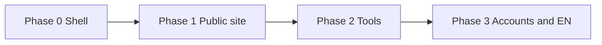
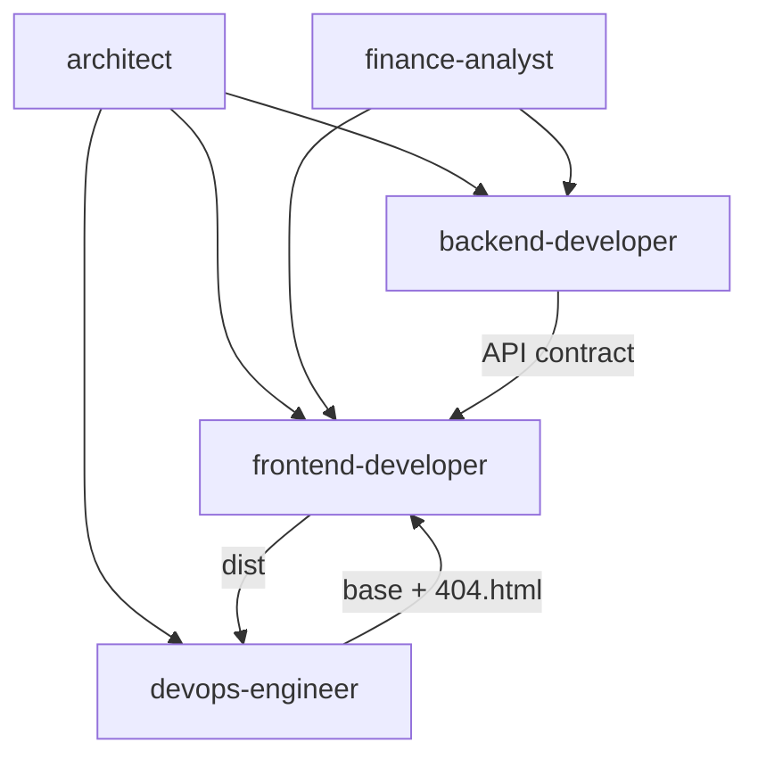

# IFA — Task Backlog

Prioritized, checkable work items by Cursor agent. Aligns with [architecture.md](./architecture.md) and [Readme.md](../Readme.md).

**Current baseline:** React + Vite SPA with `/` (language gate), `/uk` (home stub), `/en` (stub). No public deploy, no backend.

**Conventions:** user-facing copy in Ukrainian; code comments and this doc in English; financial claims require `finance-analyst` review before ship.

---

## Design reference — Stash Wealth

Reference: [stashwealth.com](https://www.stashwealth.com/) — **layout and section rhythm only**, not copy or commercial promises.

| Stash section | IFA equivalent (UA) | v1 owner |
|---------------|---------------------|----------|
| Hero + CTA | Value prop + «Дізнатися більше» | frontend-developer |
| Social proof | Trust block (education; no fake ratings) | frontend-developer |
| How it works | 3–4 steps: learn → tools → risks → decide | frontend-developer + finance-analyst |
| Offerings / Stash Plan | Topic cards: budget, savings, investments, pension | frontend-developer |
| Blog / podcast teasers | «Матеріали» — static teasers | frontend-developer |
| Footer + disclosures | Legal disclaimer, links, contact CTA | finance-analyst + frontend |
| Advisor photos | Placeholder images | frontend-developer (user photos later) |

**Do not ship:** fake testimonials, star ratings, income promises.

---

## Phased roadmap



| Phase | Goal | Exit criteria |
|-------|------|----------------|
| **0** Foundation | SPA shell | `/`, `/uk`, `/en` local; `npm run build` OK — **mostly done** |
| **1** Public MVP | Stash-like UA landing on GitHub Pages | HTTPS URL; deep links work on refresh |
| **2** Tools | First calculator | finance-analyst spec → UI → disclaimer |
| **3** Growth | EN + persistence | `/en` parity; API + PostgreSQL if needed |

---

## architect

- [ ] **P0** Link this file from `Readme.md`
- [ ] **P0** Update `architecture.md`: GitHub Pages as production host
- [ ] **P1** IA: `/uk` single-page scroll + anchors in Phase 1; `/uk/tools/*` in Phase 2
- [ ] **P1** Document static vs PostgreSQL boundary (table below) — PO sign-off
- [ ] **P1** `docs/content-model.md`: section IDs, image slots, CTA targets
- [ ] **P2** `docs/api/v1.md` sketch before backend scaffold
- [ ] **P2** Monorepo layout for `backend/` (same repo, separate deploy from Pages)
- [ ] **P3** Auth decision record: anonymous vs accounts

### Static site vs PostgreSQL

| Static (Git + GitHub Pages) | PostgreSQL + API |
|-----------------------------|------------------|
| Marketing copy, disclaimers | User accounts, sessions |
| Language gate, landing layout | Saved calculator scenarios |
| Placeholder / personal photos | Contact form submissions (if in-house) |
| Client-only calculators (if approved) | Server calculations + audit log |
| Markdown/JSON articles in repo | Dynamic CMS, comments |
| `mailto:` / external scheduler | Newsletter, email opt-in with consent |
| `VITE_*` public env vars | Secrets, API keys, PII |

---

## finance-analyst

**Role:** domain rules, UA copy, calculator specs, disclaimers. Blocks financial features without spec.

**Priorities:** **P0** blocks MVP launch · **P1** next wave · **P2** EN + deep content

### A. Positioning and tone

- [ ] **FIN-P0-001** — `docs/content/positioning.md` (one-liner, audience, forbidden claims)
- [ ] **FIN-P0-002** — `docs/content/tone-of-voice.md`
- [ ] **FIN-P0-003** — Table: forbidden phrase → safe alternative

### B. Homepage `/uk` (Stash-style sections)

- [ ] **FIN-P0-010** — `docs/content/homepage-structure.md` (section order: hero, audience, problem, approach, how-it-works, topics, tools-teaser, social-proof, cta, footer)
- [ ] **FIN-P0-011** — Hero copy → `docs/content/homepage-copy.md`
- [ ] **FIN-P0-012** — audience, problem, approach copy
- [ ] **FIN-P0-013** — how-it-works (3–4 steps)
- [ ] **FIN-P1-014** — topics cards (6 themes)
- [ ] **FIN-P1-015** — tools-teaser + cta-band
- [ ] **FIN-P1-016** — social-proof placeholder (no fake reviews; mission / about author)
- [ ] **FIN-P0-030** — `docs/content/navigation-labels.md` (header/footer UA)

### C. Calculator specs (before implementation)

- [ ] **FIN-P0-130** — `docs/specs/calculator-conventions.md` (UAH format, rounding, max inputs)
- [ ] **FIN-P0-100** — `docs/specs/calc-emergency-fund.md` (MVP calculator)
- [ ] **FIN-P0-101** — Disclaimer for emergency fund calc
- [ ] **FIN-P1-110** — `docs/specs/calc-compound-growth.md`
- [ ] **FIN-P1-111** — `docs/specs/calc-real-return.md`
- [ ] **FIN-P1-112** — `docs/specs/calc-budget-snapshot.md`
- [ ] **FIN-P2-120** — `docs/specs/calc-pension-ua.md` (with effective date; lawyer review)
- [ ] **FIN-P1-131** — Table: which calc is client-only vs API

### D. Legal and compliance

- [ ] **FIN-P0-200** — `docs/legal/disclaimers-ua.md` (full + short)
- [ ] **FIN-P0-201** — `/uk/legal` page structure + draft
- [ ] **FIN-P0-202** — `docs/legal/privacy-ua.md` (minimal for v1)
- [ ] **FIN-P0-210** — Disclaimer placement spec for homepage
- [ ] **FIN-P0-212** — Emergency fund calc disclaimer texts
- [ ] **FIN-P0-220** — `docs/legal/content-review-checklist.md`
- [ ] **FIN-P1-211** — Per-article disclaimer template
- [ ] **FIN-P1-213…218** — Per-calculator disclaimers as specs ship

### E. Content pages (after homepage)

- [ ] **FIN-P1-020** — `/uk/about` outline
- [ ] **FIN-P1-021** — `docs/content/topics-index.md`
- [ ] **FIN-P2-022** — `docs/content/article-template.md`
- [ ] **FIN-P2-023** — First article: «Резервний фонд» (800–1200 words UA)

### Open questions (PO)

1. Paid consultation / booking in v1?
2. Brand name in hero or neutral «незалежний радник»?
3. Confirm emergency fund as first calculator?
4. Client-only vs API for v1 calculators?
5. Real testimonials at launch or placeholders only?

---

## frontend-developer

### Design system (Stash-like)

- [ ] **P1** `frontend/src/styles/tokens.css` — colors, spacing, typography, breakpoints
- [ ] **P1** Layout: `Container`, `Section`, `Grid`, `Stack`
- [ ] **P1** UI: `Button`, `Card`, `Link`, `Badge`
- [ ] **P1** `SiteHeader` — nav anchors, language switcher
- [ ] **P1** `SiteFooter` — disclaimer, links, CTA
- [ ] **P1** Mobile nav (hamburger or stacked)

### Landing `/uk`

- [ ] **P1** `HeroSection`, `SocialProofSection`, `HowItWorksSection`
- [ ] **P1** `OfferingsSection`, `MaterialsSection`, `CtaSection`
- [ ] **P1** Refactor `HomePage.tsx` to compose sections
- [ ] **P1** `frontend/public/images/placeholders/` — hero, avatar, cards (SVG)

### GitHub Pages compatibility

- [ ] **P1** Vite `base` for Pages (see below)
- [ ] **P1** `BrowserRouter basename={import.meta.env.BASE_URL}` in `main.tsx`
- [ ] **P1** Test `npm run build && npm run preview` with production `base`

### Phase 2+

- [ ] **P2** `frontend/src/api/client.ts` + `VITE_API_URL`
- [ ] **P2** `/uk/tools/<slug>` calculator page per spec
- [ ] **P3** Full `/en` landing; `content/uk.ts` + `en.ts`

**Blocks:** FIN-P0-010…013, FIN-P0-200, FIN-P0-210 before shipping homepage; FIN-P0-100 before first calculator.

---

## backend-developer

**Phase 1:** no backend required.

### Phase 2a — API (no DB)

- [ ] **P2** Scaffold `backend/` — Node.js + TypeScript, Fastify or Express
- [ ] **P2** `GET /api/v1/health`
- [ ] **P2** `POST /api/v1/calc/:slug` per finance-analyst spec
- [ ] **P2** Validation (zod); logic in `services/`
- [ ] **P2** CORS: GitHub Pages origin + localhost
- [ ] **P2** Publish `docs/api/v1.md` before frontend integration

### Phase 2b — PostgreSQL

- [ ] **P2** Docker Compose for local Postgres
- [ ] **P2** Prisma or Drizzle + migrations
- [ ] **P2** `calculation_logs` — slug, input hash, timestamp (no PII)
- [ ] **P2** `contact_submissions` — if in-house contact form
- [ ] **P2** `DATABASE_URL` in `.env` (never committed)

### Phase 3 — accounts

- [ ] **P3** Auth (JWT httpOnly or sessions in Postgres)
- [ ] **P3** `users`, `sessions`; password hashing
- [ ] **P3** Saved scenarios / preferences tables
- [ ] **P3** Rate limiting; structured logging

**Note:** Backend does **not** run on GitHub Pages. Host separately (Railway, Render, VPS).

---

## devops-engineer

### GitHub repo

- [ ] **P0** Create GitHub repo; `git remote add origin`; push `main`
- [ ] **P0** `.gitignore` — `node_modules/`, `dist/`, `.env`
- [ ] **P1** «View site» link in Readme after first deploy

### GitHub Pages deploy

- [ ] **P1** `.github/workflows/deploy-pages.yml` — build `frontend`, upload `dist`
- [ ] **P1** Repo Settings → Pages → Source: **GitHub Actions**
- [ ] **P1** `frontend/public/.nojekyll`
- [ ] **P1** Post-build: `cp dist/index.html dist/404.html` (SPA fallback)
- [ ] **P1** Vite `base`: `/ifa/` for project site or `/` for user site / custom domain
- [ ] **P1** Smoke test: `/`, `/uk`, `/en` via navigation and direct URL refresh

### CI

- [ ] **P1** `.github/workflows/ci.yml` — `npm ci && npm run build` on PR/push
- [ ] **P2** Backend CI when `backend/` exists

### GitHub Pages config

| Concern | Solution |
|---------|----------|
| Project URL `user.github.io/ifa/` | `base: '/ifa/'` in Vite |
| User/custom domain | `base: '/'` |
| React Router | `basename={import.meta.env.BASE_URL}` |
| Deep links on refresh | `404.html` = copy of `index.html` |
| CI flag | `GITHUB_PAGES=true` in workflow for `base` |

```js
// vite.config.js
base: process.env.GITHUB_PAGES === 'true' ? '/ifa/' : '/',
```

---

## Cross-agent dependencies



| Blocker | Blocked |
|---------|---------|
| PO confirms Pages URL (`/ifa/` vs `/`) | Vite base, Router basename, deploy workflow |
| FIN-P0-010…013, FIN-P0-200 | Homepage copy and footer |
| FIN-P0-100 | First calculator |
| architect API boundary sign-off | Backend scope |
| OPS first deploy | Public QA |

### Suggested sprint order

1. architect — Pages URL + update architecture.md
2. devops-engineer — repo, CI, Pages workflow
3. finance-analyst — P0 copy + legal + emergency fund spec
4. frontend-developer — design system + `/uk` sections
5. devops-engineer — production deploy + smoke tests
6. Phase 2: calculator (client or API per decision)

---

## Definition of done — Phase 1

- [ ] Public HTTPS URL on GitHub Pages
- [ ] `/`, `/uk`, `/en` work on navigation and direct refresh
- [ ] `/uk` has Stash-like sections + finance-analyst disclaimer
- [ ] No secrets in git; CI build green
- [ ] Placeholder images only; user photos swapped later
